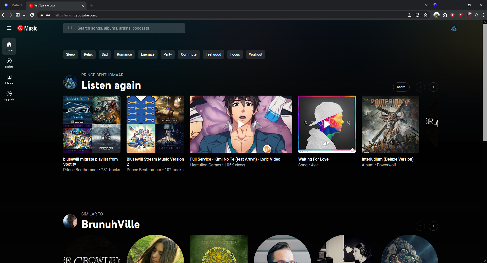
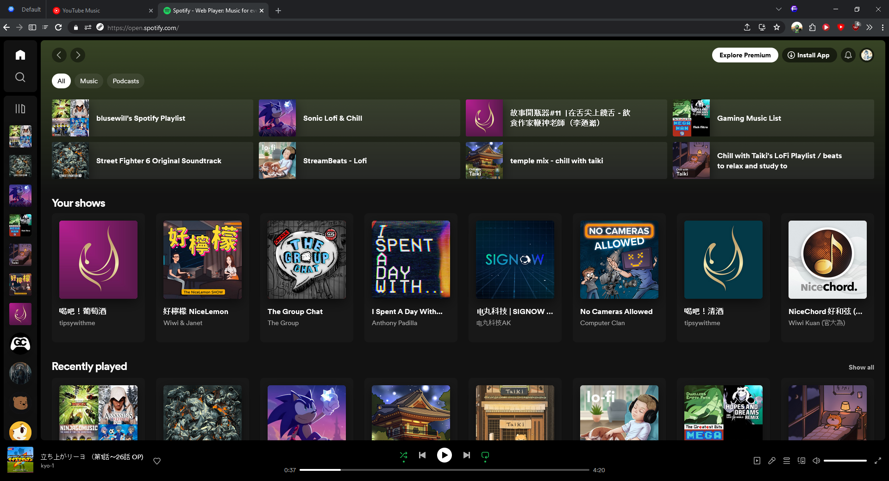
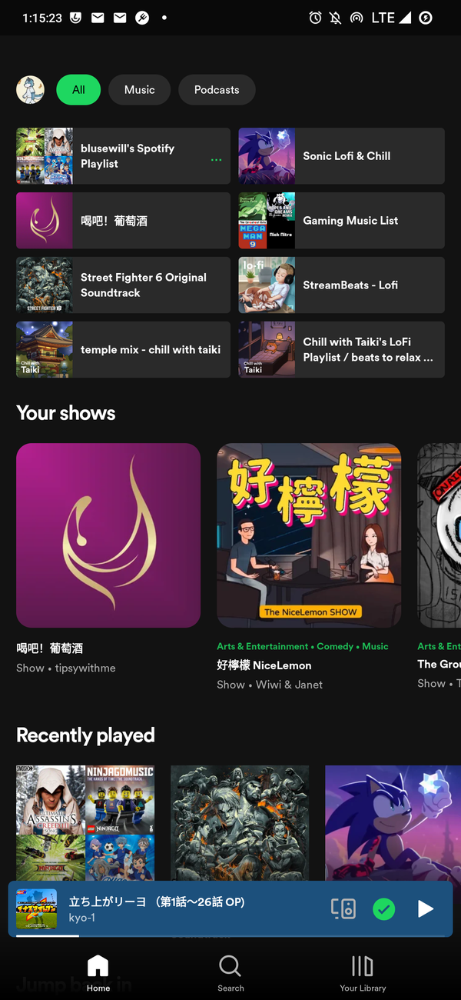

<!--more-->

So I started to give YouTube Music another try again. Since for the past years I am using the Spotify because of how their custom client just works better than YouTube Music.

But I recently give YouTube Music another try and... This sucks! even with a custom client on that only didn't push the service to the fun state that I can say. YES! THIS IS THE MUSIC CLIENT THAT I CAN USE FOREVER!

This article will be my personal opinion. If you are a user that really likes YouTube Music. Sorry about every single thing I am going to say because it's going to be me being a very angry person XD

## User Interface

I think User Interface makes user felt comfortable or not

So it's a requirement for me on how to use it great

Which YouTube Music didn't fit in my requirement here is why

### Desktop/Web Home Interface

Let's talking about the starting page which is homepage.

Instead of the stacked Listen Again. They decided to went into a album mode listen again.

I don't know why they decided to do this? Maybe is because They want to make this design makes the Listen again only can display maxium 6 on the first page if the Music is not published to the YouTube Music then is going to be more wider which wastes more real estate.

Compare to Spotify

You can see there is no big gap between everything.

As you can see There rarely any Text to expain everything.

Even if there is text is also small doesn't very large.

### Mobile Home Interface

So let's start talking about mobile interface.

Which is much more better than the Web Version on the Desktop we have seemed

But it's still kind bad?

First I have to give YouTube Music Credit that they did their mobile version more better

But there is still something can be improved which is The font can be more smaller and Don't make that tag very big!

And it's also using a lot of spaces on spacing. Why you need such a large spacing?

And I don't need bunch of text explaining what things is what.

You Just have to put it on the top!

### Player Desktop Interface

So YouTube Music's Player is completely messed up

First I don't care about it's seperated interface. Since I can still control at the bottom

But first thing. Why you are still calling me to Save to my Playlist even if this is my own playlist. On my own account? There is no point for it. Unless I want to create another one.

Which is waste of space I think.

Also What happened to your lyrics

You made your amazing Home Page Text Very big. And Made the Lyrics this small and doesn't sync?

That's too bad because Spotify have their lyrics bigger and it syncs

It's this even running on the Same lyrics provider?
