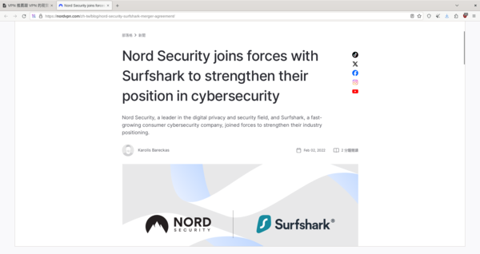
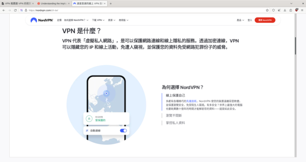
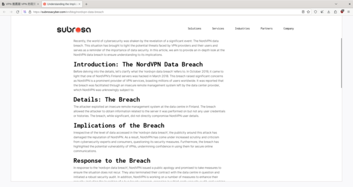
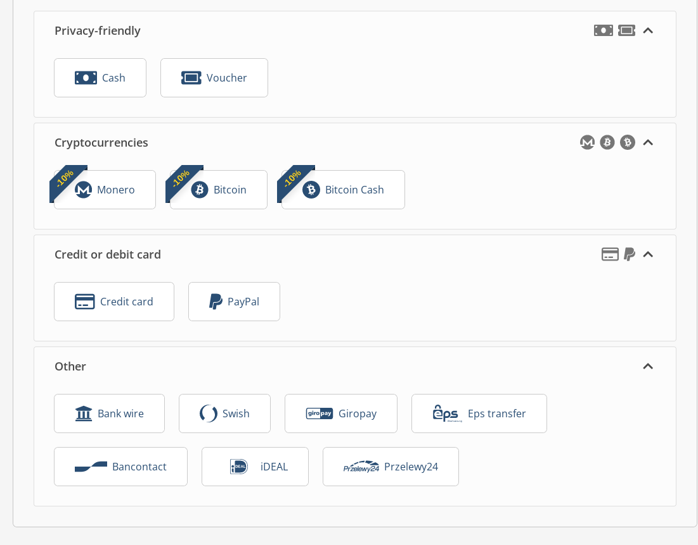
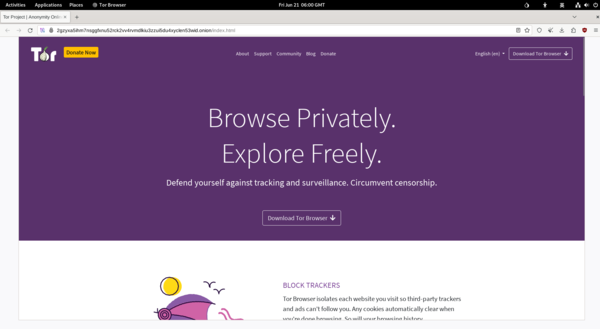

<!--more-->

VPN 是一個賺錢項目，多賺錢呢

賺到其實 VPN 廠商只有那幾個，我說的那幾個就是一間公司就是要把他搞到有上百間公司有 VPN 的感覺，這邊就給大家一個範例

## 很多 VPN 都是同一家

大家都知道 NordVPN 跟 Surfshark VPN 吧？

但是你不知道的是，這兩間其實都是同一家廠商

他們的客服可能是不同人，但是技術可能都是一樣的。

## VPN 是用了甚麼技術

應該說，所有的 VPN 都是透過一個東西叫做 OpenVPN 或是 Wireguard 的程式運行的

那 Wireguard 的連線速度比 OpenVPN 還要快，所以現在很多廠商都開始漸漸換到 Wireguard

VPN 的連線跟一個橋很像，而沒有人可以上這座橋，這也是很多 VPN 廠商會誇大的東西。

但是事實面是，這些明明都是可以自己架設的東西，為甚麼還要第三方呢？

~~其實簡單來說就是懶得研究~~

## VPN 的那些假訊息

我們來看一下 NordVPN 宣傳甚麼

Hmm 先進技術？

其實就跟我剛剛講的，這個 VPN 技術完全可以下載 OpenVPN 或是 Wireguard 然後架設在自己家電腦就可以做到一樣的效果。

免受陌生人窺視？其實為甚麼今天拿 NordVPN 來當範例是因為 NordVPN 有被資料外洩過，但是 NordVPN 承認說沒有使用者的資料被外洩，但是是真的還是假的呢，目前沒有人知道。

還有一些 YouTuber 說 VPN 可以替代防毒軟體的，千萬不要相信阿！

## VPN 推薦

好，現在罵過 99% 現在在市場上的 VPN 過後，現在終於要推薦 VPN 廠商了

雖說我是建議自己架設 VPN 在家的人，這樣來說最安全，因為東西都是你的

但是不是有人都有那種技術跟時間，所以我要推薦一家叫做 [Mullvad](https://mullvad.net/zh-hant) 的 VPN 廠商

先說我沒有收他們的錢，我永遠也不會收到他們的錢。因為他們更本不做工商的！

那他們的安全性也很直接，它們不用帳號密碼，它們是直接髓機帳號給你的，基本上這樣就安全性就吊打很多 VPN 廠商了

因為 VPN 廠商沒有紀錄帳號密碼，他們也沒有辦法外洩任何資料

那他們的支付方式也很多元

你可以看到有一堆你想都沒有想過的，但是 mullvad 很多都是給國外使用者的，所以你大概只能用加密貨幣，信用卡還有 Paypal 了

所以台灣目前支付最安全的方式就是直接使用加密貨幣了，因為信用卡跟 Paypal 都是可以查的，但是如果你是一般使用者應該也不會想太多。

## 但是一定要 VPN 嗎?

雖說我剛剛都說 VPN 很安全，但是 [Tor](https://www.torproject.org/) 也是一個不錯的選項

Tor 最有名的應該就是暗網了吧，但是你不知道的是 Tor 這個技術也是一個非常安全的技術。

基本上就是讓你的電腦連接到三個不同的代理伺服器，之後打開你想要的網頁，這就是為甚麼 Tor 叫做洋蔥瀏覽器

因為就跟洋蔥一樣，最外面一層看不出東西來，要撥到最裡面才看的到。

那對你剛剛聽到我說 **代理伺服器** 這又是甚麼意思呢？

## 代理伺服器是甚麼

代理伺服器又稱為 Proxy 全部的瀏覽器都有這個功能，只在他的通道不是加密的而已。

但是因為 VPN 跟 Proxy 會搞混，所以就有一間廠商 Opera 說 Proxy 是 VPN 其實不是歐！

但是其實 Proxy 可以做到跟 VPN 類似的事情就對了。

## 那 Tor 是用 Proxy 為甚麼還推薦呢?

因為 Tor 就是在 Proxy 之上又做了加密，加上就算你用了代理，警察想要查到你家還要去問代理伺服器廠商

那 Tor 會自己重新整理自己的代理，所以基本上是查不到的。

那有些網路會 BAN 掉 Tor 的網路，導致連線不到 Tor 網路

但是 Tor 開發者也想到了這點，所以開發了一個東西叫做 Bridges

這個就像是一座橋，但是跟我剛剛說的自己的橋不一樣，這是大家都共用的橋。

所以有一些 Bridges 會被 BAN 掉，但是世界上還有成千上萬的貢獻者在分享這些 Tor 的 Bridges 所以想 BAN 也 BAN 不完。

加上這 Bridges 的分配方式，你一定沒有看過，他可是透過 Emoji 來分配的呢！

## 結語

這就是今天的推薦拉，雖說不是什麼非常好的推薦...

但是希望大家對 VPN 也有了一定的認識。

如果有的話，我希望大家也可以按右下角的分享按鈕來分享給一些考慮要買 VPN 的人

~~然後讓它知道原來現在市面上大部分的 VPN 都有詐騙成份~~

那我們就下一篇文章見拉！
